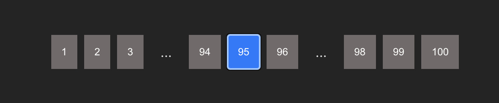
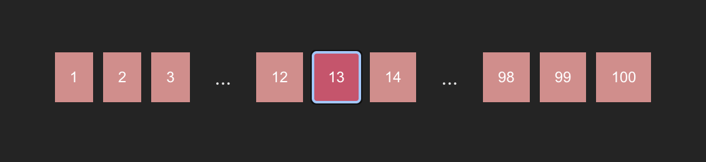
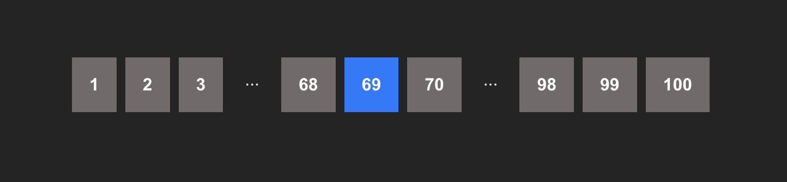

## Screens shots

Size 12


Size 100


Size 3


Primary, size 'L'


Secondary, size 'M'



## Getting Started

Clone the Repository

```bash
git clone https://github.com/KirilllAll/test-next-fabric.git
cd your-repo
```

Install Dependencies

```bash
npm install
```

Development Mode

```bash
npm run dev
```

Build the Project

```bash
npm run build
```

Start the Production Server

```bash
npm start
```

Deployment on Vercel

Install Vercel CLI

```bash
npm install -g vercel

vercel
```